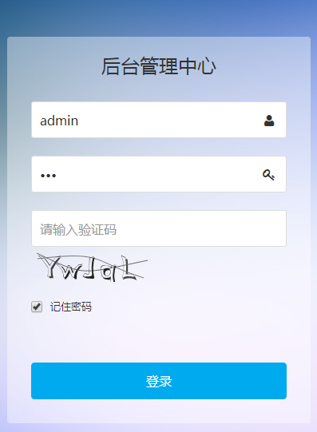
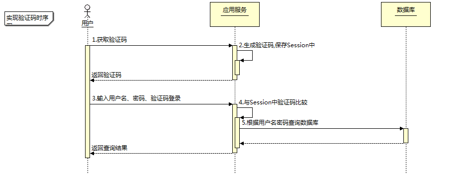

# usermanager_ejs

## 用户管理
# nodejs使用 svg-captcha 做验证码及验证
## 学习内容
- 效果演示
- 验证码流程
- 具体实现

## 效果演示

## 验证码流程


## 具体实现
### 后台生成验证码
1. 安装svg-captcha
   npm install svg-captcha --save
2. 验证码请求接口

```javascript
app.get('/codeimg.do', function (req, res) {
    var codeConfig = {
        size: 5,// 验证码长度
        ignoreChars: '0o1i', // 验证码字符中排除 0o1i
        noise: 2, // 干扰线条的数量
        height: 44 
    }
    var captcha = svgCaptcha.create(codeConfig);
    req.session.captcha = captcha.text.toLowerCase(); //存session用于验证接口获取文字码
    res.setHeader('Content-Type', 'image/svg+xml');
    res.write(String(captcha.data));
    res.end();
});
```

调用 create() 之后，会返回一个对象，结构如下：{data:'',text:''}。
```
data：验证码 svg 图片
text: 验证码字符
create()的参数如下：
	 size: 4 // 验证码长度
	 ignoreChars: '0o1i' // 验证码字符中排除 0o1i
	 noise: 1 // 干扰线条的数量
	 color: true // 验证码的字符是否有颜色，默认没有，如果设定了背景，则默认有
	 background: '#cc9966' // 验证码图片背景颜色
```
1. 前端页面
```html
 <input type="text" class="input input-big" name="imgCode" placeholder="请输入验证码" />
 <span></span>

 <script>
        changeCode();
        $("#codeImg").bind("click", changeCode);

        function changeCode() {
            $("#codeImg").attr("src","/codeimg.do?"+Math.random());
        }
    </script>
```

